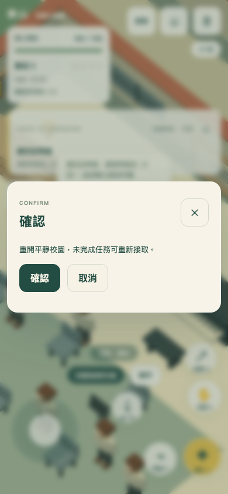

# 按鈕間距驗收（2026-10-09）

修正確認視窗、商店、答題與其他相鄰按鈕沒有群組間距的問題。鬆散相鄰按鈕使用可換行群組，水平與垂直間距均為12px，群組上下亦保留12px；保留原有按鈕與事件。既有選單、圖鑑分頁及歡迎頁同步使用12px間距，長標題可換行。遊戲操作鍵一般12px，手機頂部8px、側邊10px；投擲與指揮鍵分開，手機指揮鍵也避開「動作」。

實際 Chromium 桌面與觸控模擬通過105組版面檢查：1280×900、844×390、390×844、320×700各23種選單，以及空手／手持／手持合唱三種HUD狀態，另含320px試聽頁。檢查所有可見按鈕矩形之間至少8px距離（0.5px像素捨入容差），面板沒有橫向溢出。實際觸控「取消」及鍵盤Enter答題通過，沒有頁面例外。場景由既有開發入口準備；未點擊清除存檔等破壞性確認。

檢查程式：scripts/button-spacing-qa.ts；結果：artifacts/button-spacing-qa.json。

實體手機、Safari及所有玩家自訂字體／縮放組合尚未驗證。
