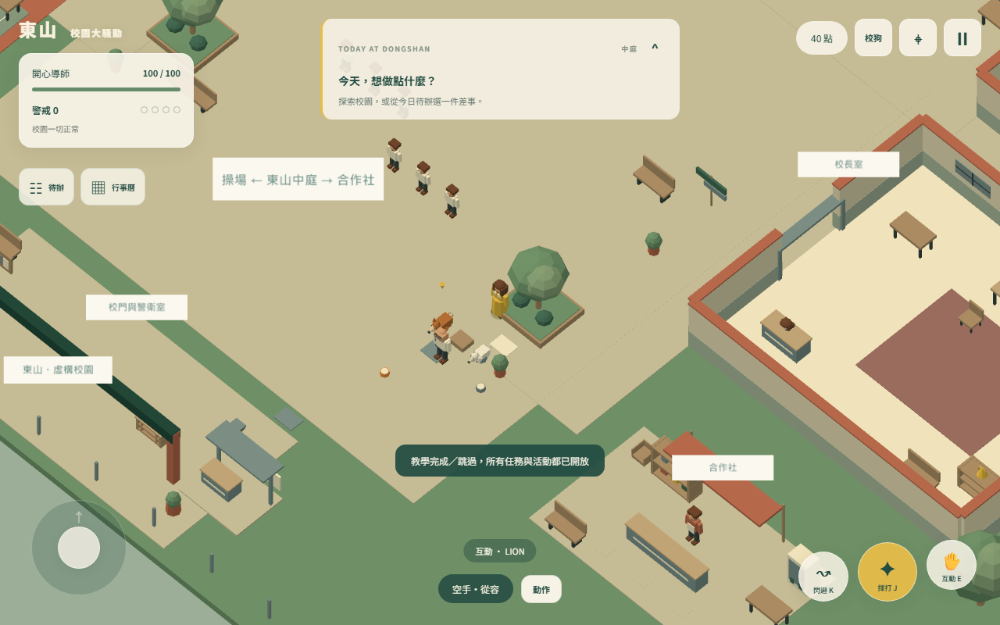
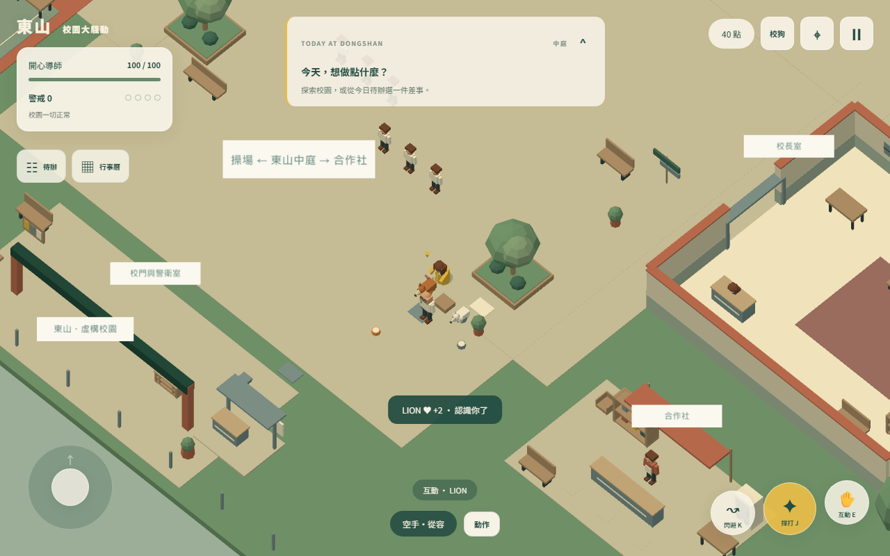
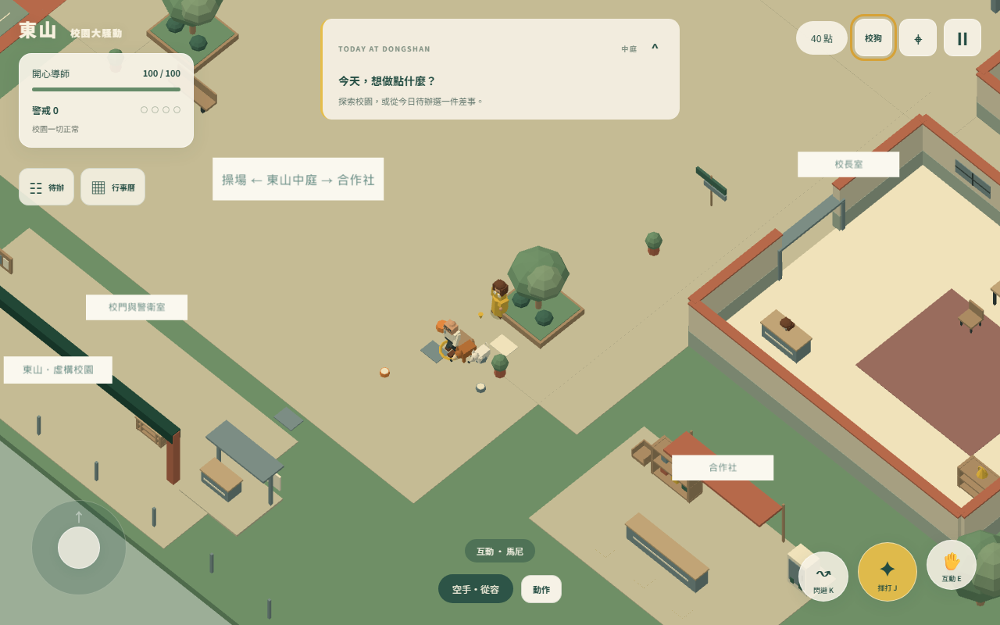
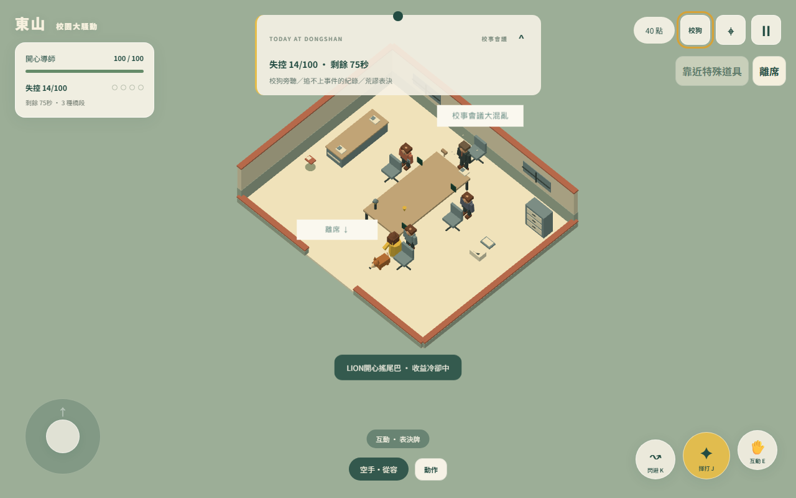
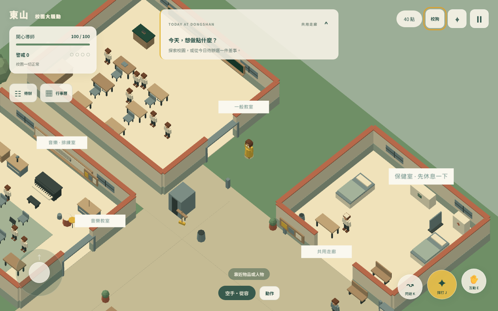
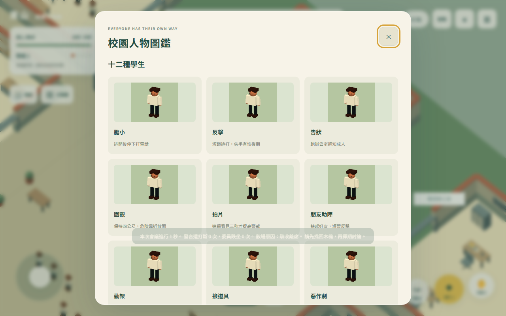
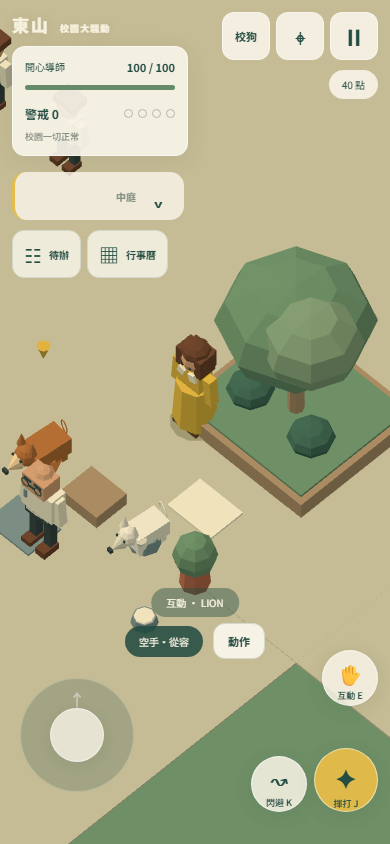

# v1.2 實際驗收與遊戲畫面

日期2026-10-08。保留十區／四活動場景、原40任務、麥克風與完整原15會議橋段；增補第16狗旁聽。開始基線f25b16e，工作目錄乾淨。沒有改動原scene.ts／scene-models.ts／world.ts。所有圖片為實際WebGL遊戲PNG，沒有使用示意圖或生成圖片。

## 檢查結果

| 驗收 | 結果及方法 |
|---|---|
| 完整自動化 | 85項、0失敗；artifacts/dogs-core-tests.log |
| 型別與正式建置 | tsc --noEmit＋Vite成功，Pages資產與分享圖檢查成功；artifacts/dogs-build.log |
| 兩狗免傷 | 12狀態×全部登錄道具揮打／全部portable實際投擲碰撞；NPC／環境誤傳入口拒絕，沒有HP／受傷欄位、命中事件或吃掉成人命中名額。原NPC攻擊只以玩家為目標，狗不入碰撞傷害名單。 |
| 老師正常受擊 | 規則驗證走路／說話／餵狗／交付前後；瀏覽器5狀態×徒手、手持、投擲共15，真實J／Q、白閃、擊退、ScienceHit。 |
| 會議全員受擊 | 現有6角色×16狀態×3方式的規則測試通過；新增旁聽場4委員×3方式共12實際J／Q命中。兩狗協助時成人仍可被打、受擊釋放控制。 |
| 關係與冷卻 | 摸摸0.6秒後結算，中斷0收益、獨立收益冷卻、零食成功才扣、讀檔保留、收益帳本及六任務一次性；原地轉圈不加陪走收益。 |
| 六任務 | scripts/dogs-route-qa.ts沿原牆／桌椅格網，用移動輸入走每個waypoint、E取原物件／定位、向老師交付；兩條未滿45的限定陪走實際完成。無玩家瞬移或直接加任務獎勵。artifacts/dogs-route-qa.json。 |
| 球與角色身分 | 一顆原球，取回完成才收益；拿走／不可達／協助中斷取消；同一兩狗actor移交，無雙活躍副本。讀檔／救援不抹關係、不複製物品。 |
| 協助 | 75門檻、明確敵對成人、8m可達、一次一狗、接觸才消耗20秒、失效不消耗、最多2.5／2秒無HP傷害、玩家受擊優先；兩種接觸演出實際截圖。 |
| 16橋段 | scripts/meeting-modules-qa.ts真實J／Q／F／E逐一特色互動、受擊／恢復與16次順序清理全通過；原物件／NPC引用回復、臨時物件0、timers0。 |
| 手機與圖鑑 | 390×844模擬，收合172px、chevron垂直中心誤差0px、small margin-top=0、無頁面overflow；41人物模型PNG已解碼，道具及擊倒圖鑑亦共用縮圖。名牌屋頂上方、不和HUD／名牌重疊。 |
| 正式成品 | 真實dist啟動、操作、兩狗卡片6任務／12指令、41圖鑑圖片、校安／理化名稱、v1.2、手機收合；無DEV入口、404或pageerror。artifacts/dogs-production-qa.json。 |

瀏覽器矩陣以DEV準備合法位置／狀態，鍵盤派發遊戲操作並以30Hz步進、真實renderer截圖；不直接呼叫命中特色加分。規則全狀態矩陣與瀏覽器15／12組的範圍分開記錄。原v1.1的288組瀏覽器證據仍保留，不能當作本次重跑結果。

## 真實畫面

其他圖片：dogs-teacher-hit-bare／held／throw、dogs-cards／mobile-cards、dogs-quest-六ID、meeting-module-16ID、dogs-production-*。原始清單與測量在artifacts/dogs-browser-qa.json。

## 效能與界線

Windows i7-10700@2.90GHz、Chromium 141.0.7390.37、headless SwiftShader、Low、1280×800、每場4秒。

| 場景 | 樣本 | frame p50 ms | p95 ms | calls | triangles | 活躍人＋狗 |
|---|---:|---:|---:|---:|---:|---:|
| 普通校園 | 56 | 66.7 | 99.9 | 11 | 21382 | 13 |
| 老師餵兩狗 | 58 | 66.7 | 100.0 | 11 | 21382 | 13 |
| 追逐中協助 | 58 | 66.7 | 100.0 | 11 | 21478 | 13 |
| 狗旁聽加列印表決 | 178 | 16.7 | 33.4 | 8 | 3608 | 5 |

幾何固定7，會議上限5活躍角色，原AI Low16／Standard20含兩狗與老師。桌面SwiftShader屬軟體繪圖，校園中位66.7ms，不能把這些數字宣称手機60FPS。未驗證實體手機GPU、Safari、長時間熱降頻、音訊人工聽感與人工15–25分鐘養成節奏。Vite主bundle>500kB提示保留，非建置失敗。讀檔採安全解除暫態工作，保留永久數值與已消耗冷卻。

完整操作／配置與擴充：DOGS_GUIDE.md。既有main→GitHub Actions→Pages流程已成功發布2714078；正式網址：https://ml-yoyohuang.github.io/teacher-simulator/。公開網站v1.2操作、圖鑑圖片與手機介面驗收通過，無404／pageerror；結果與線上截圖見artifacts/dogs-live-qa.json、DOGS_RELEASE.md。
