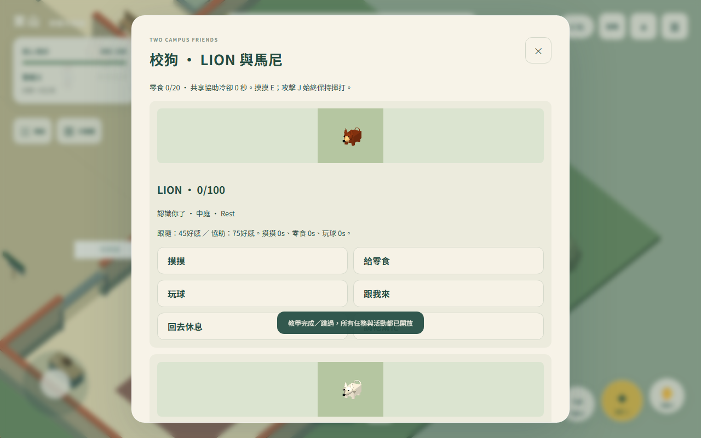
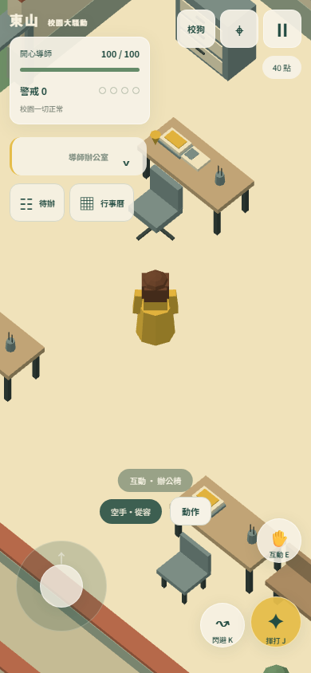

# v1.2 GitHub Pages 發布確認

2026-10-08已發布：[正式遊戲](https://ml-yoyohuang.github.io/teacher-simulator/)。

功能提交 `2714078fc58851b83f0fc076451dd2b981ce16e7`，含先前已完成的校園／會議修改。GitHub Actions [37752414366](https://github.com/ml-yoyohuang/teacher-simulator/actions/runs/37752414366) 的build與deploy均success；遠端main正常快進推送，未強制覆寫。

發布後重新用Chromium141.0.7390.37開啟公開網址，實際確認歡迎页v1.2、進入遊戲、W移动及J揮打、兩狗卡片、六任務與12指令、41張已解碼人物縮圖、校安／理化老師名稱、手機390×844提示收合172px。無開發入口、404或pageerror。原始結果：artifacts/dogs-live-qa.json。85項完整測試與遊戲功能矩陣見DOGS_QA_REPORT.md；手機實機、Safari與人工音訊聽感仍未驗證。

重現線上驗收可對scripts/dogs-production-qa.ts設定：`QA_URL=https://ml-yoyohuang.github.io/teacher-simulator/`、`QA_OUT=artifacts/dogs-live-qa.json`、`QA_SHOT_PREFIX=dogs-live`；預設仍測本地4173正式dist，不覆蓋DEV遊戲證據。

本文件及線上截圖採後續 `[skip ci]` 文件提交；已發布的遊戲資產不需再建置。
