# 六種事件實際遊戲畫面

由 `scripts/life-qa.ts` 在 Chromium 真實 WebGL 遊戲拍攝，1280×800；測試透過開發入口建立固定事件，人物仍走正式導航，玩家沿 World.path 真實步行，E／J 使用鍵盤介入。沒有以概念圖或模擬排版代替遊戲。

## 1. 營養午餐

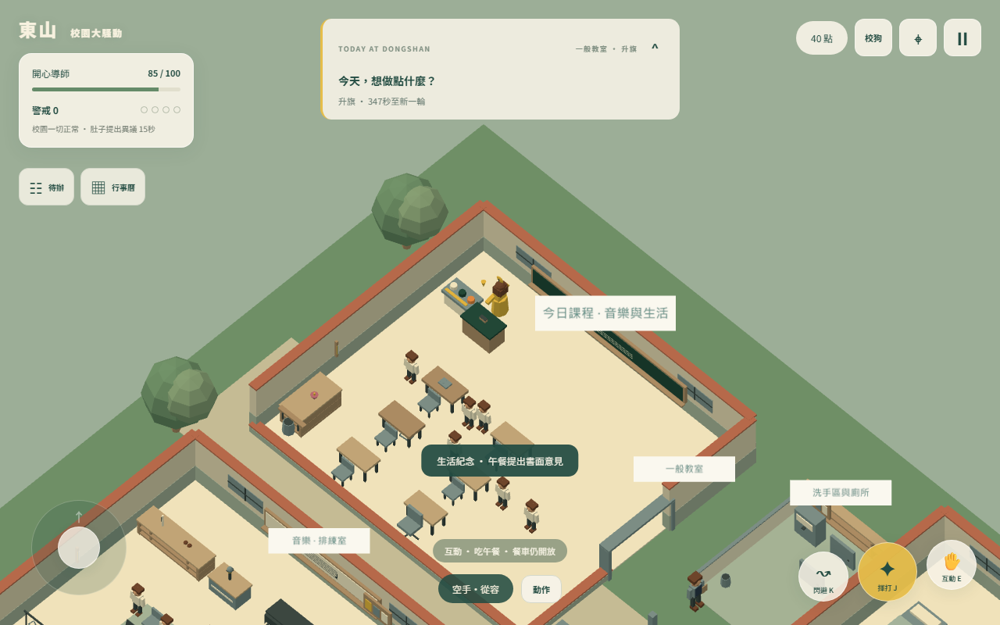

## 2. 酸味牛奶與拖把

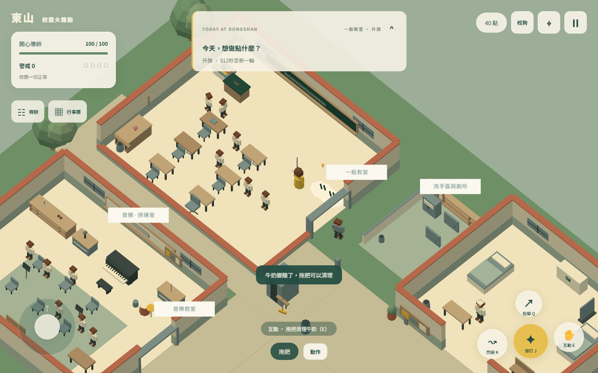

## 3. 橘子掃把棒球

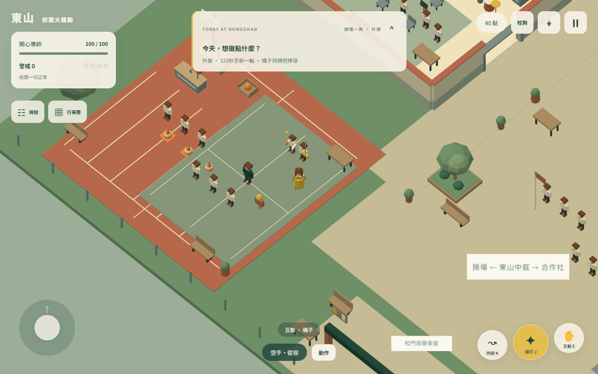
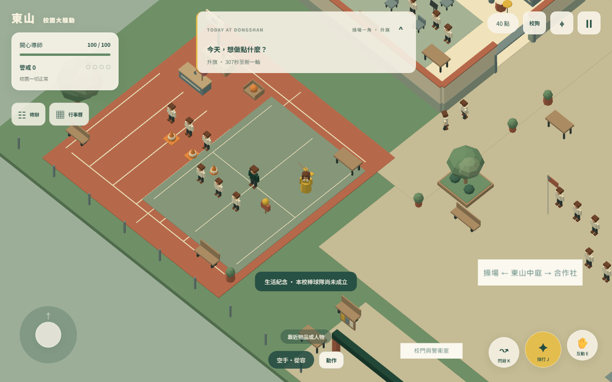

## 4. 陀螺與警戒隔離

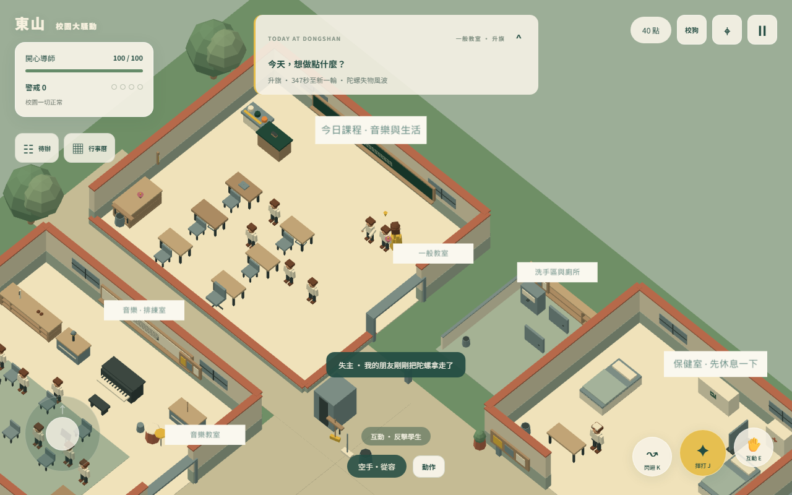
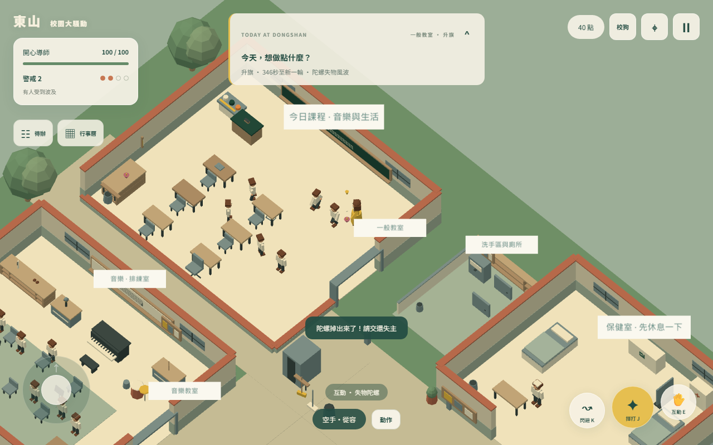
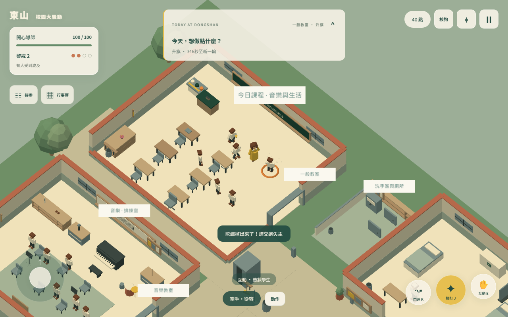

## 5. 校安巡查

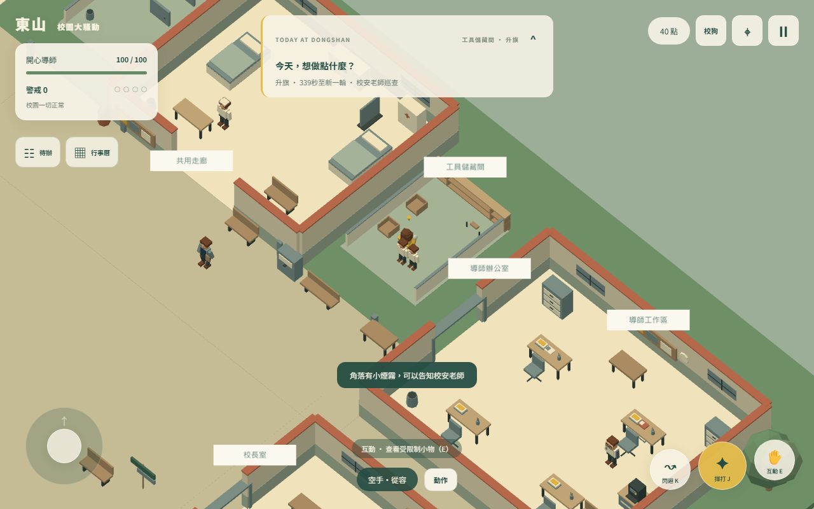

## 6. 升旗與手機

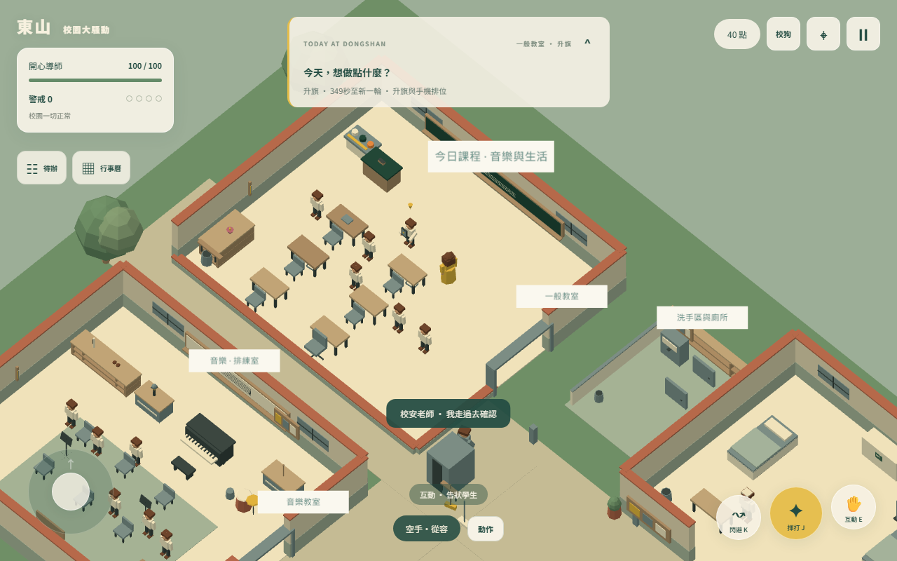
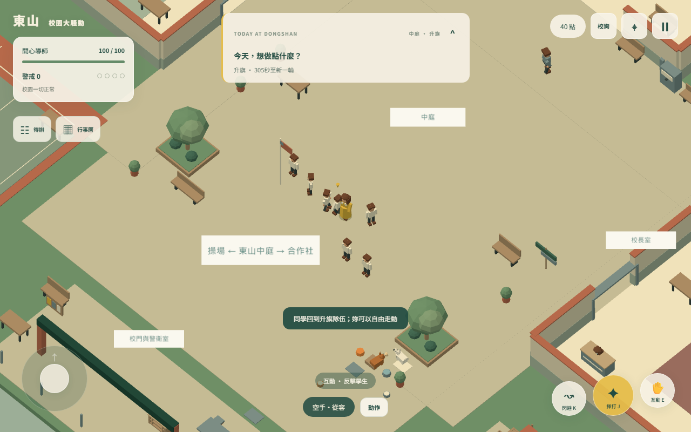

## 選單與直式畫面

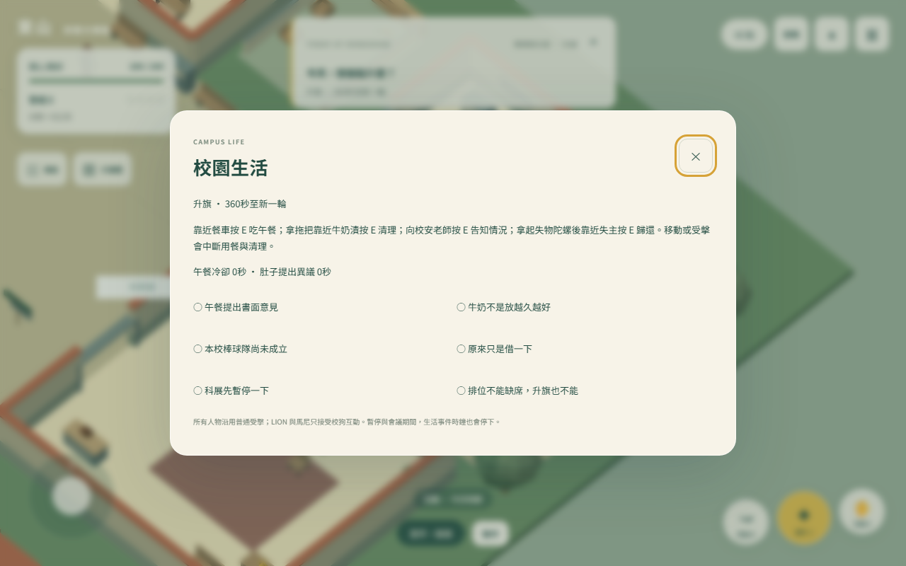
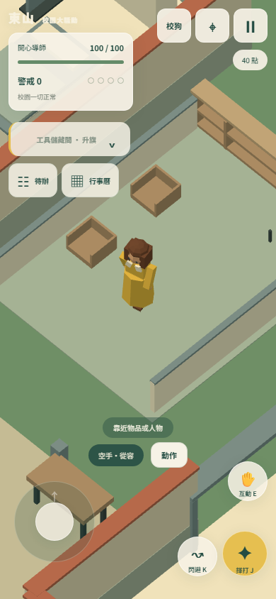
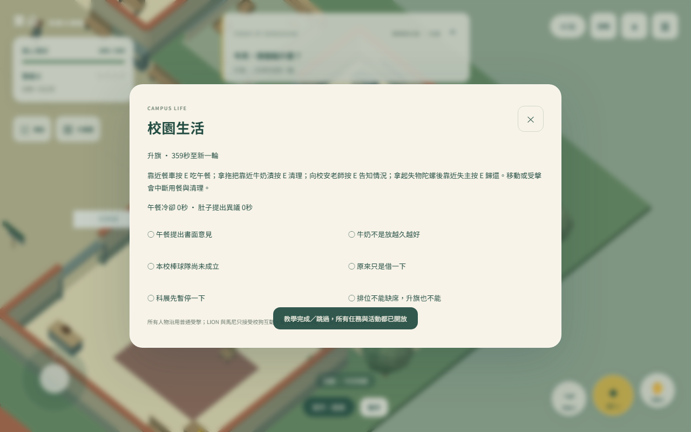
