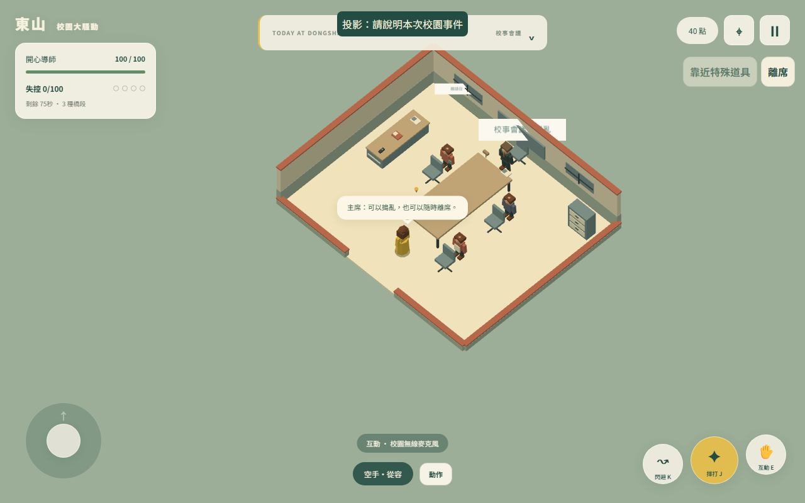
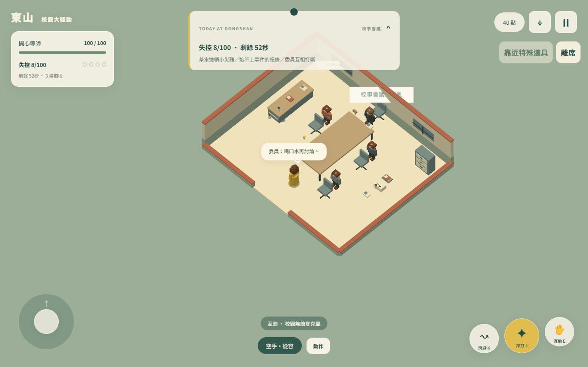
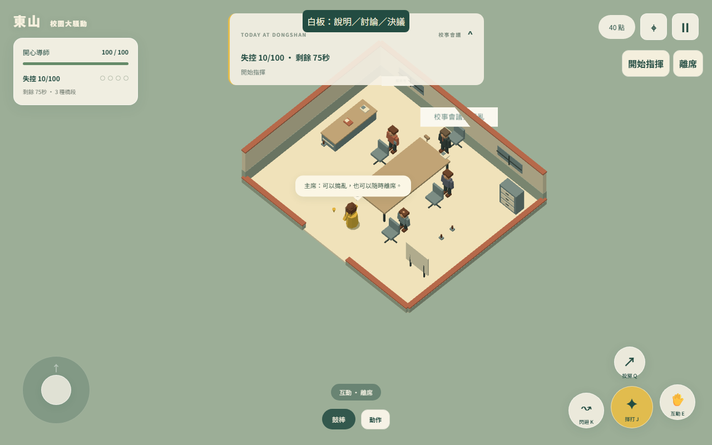
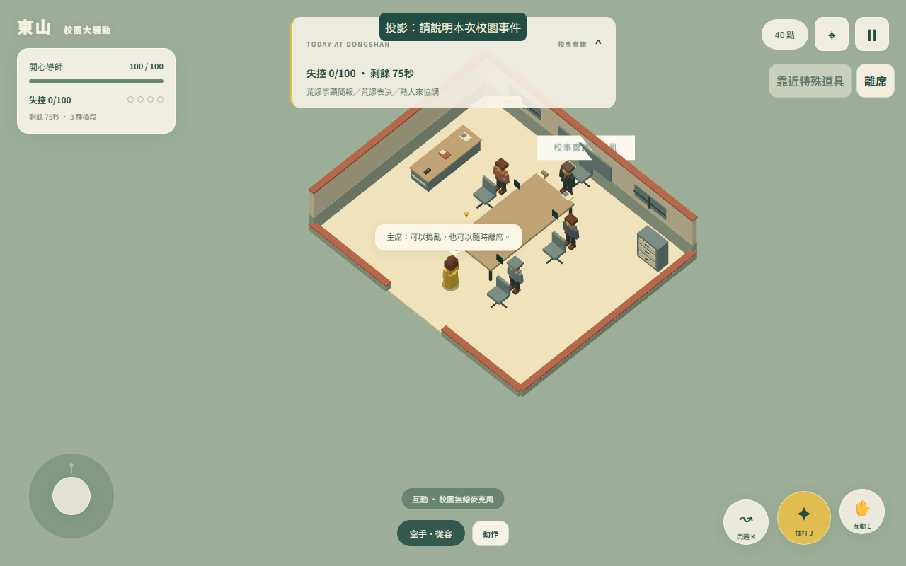
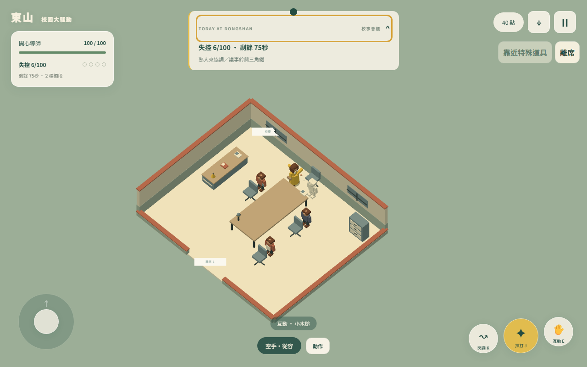
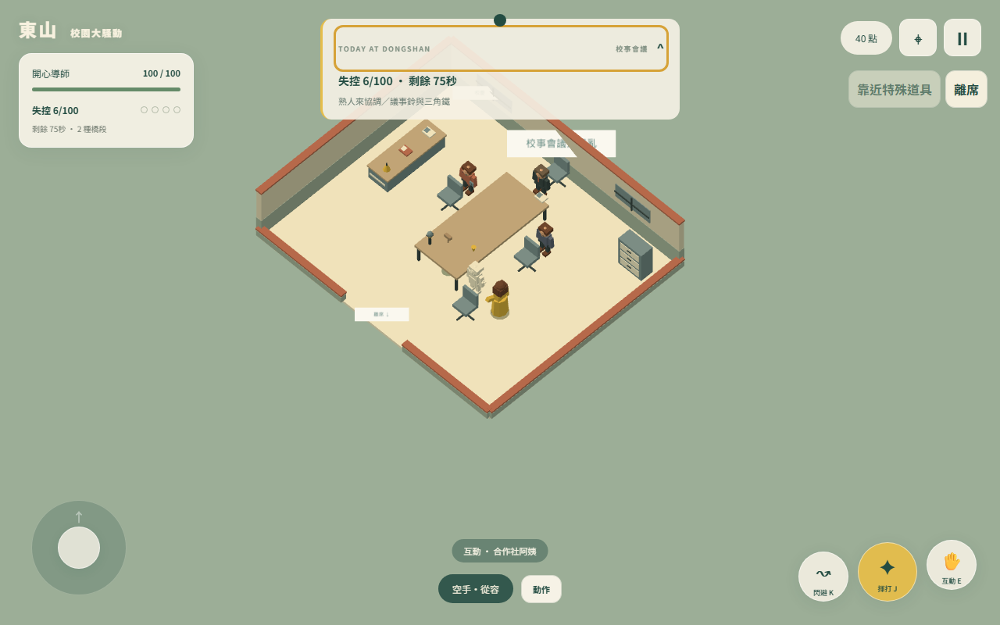
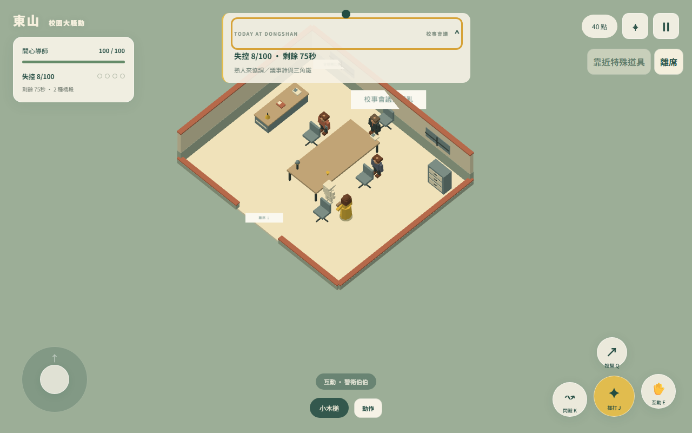
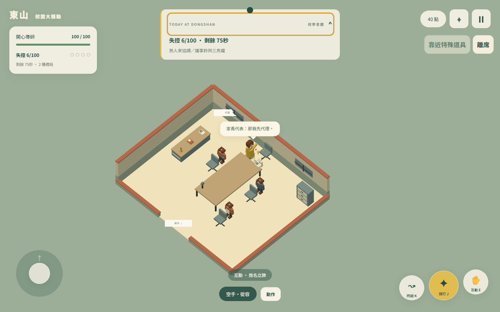
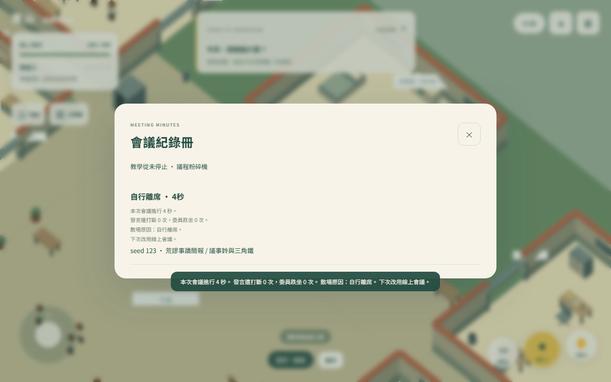
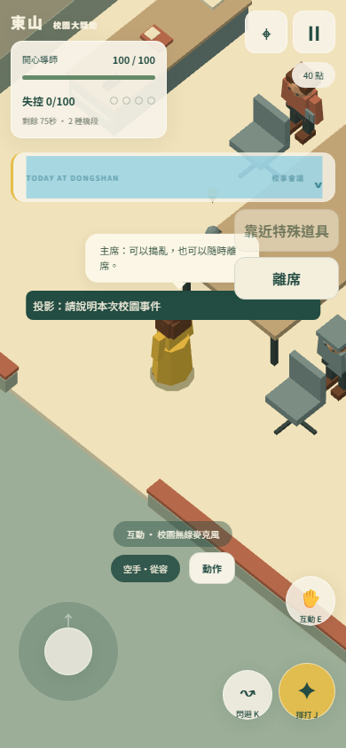

# 校事會議實際截圖

全部由本地遊戲 WebGL 畫面產生；沒有使用生成圖。完整方法與逐組結果見 artifacts/meeting-browser-qa.json、meeting-modules-qa.json。角色／狀態為開發情境準備，攻擊由實際 J／Q 事件與原 30Hz 戰鬥處理。手機圖為觸控模擬，並非實機。

## 房間與不同橋段

## 委員與客座受擊

另外保留每角色三種攻擊及主席 16 種狀態截圖，檔名 `meeting-hit-*.png`；每橋段截圖為 `meeting-module-*.png`。全部 288 組瀏覽器命中／位移结果在 JSON 矩陣，截圖是取樣，不宣稱人工逐張檢視全部組合。

## 紀錄冊與手機畫面

