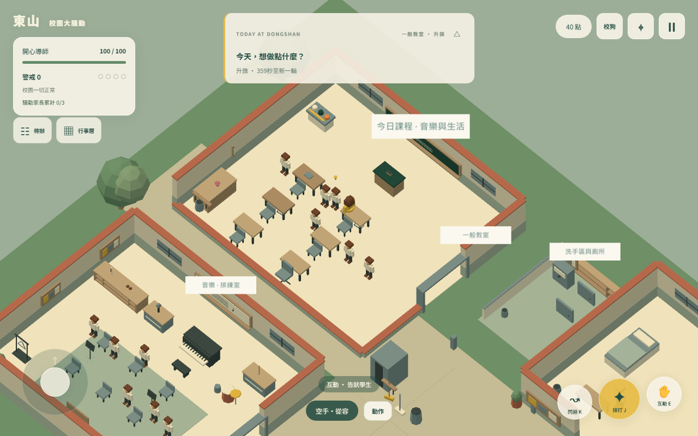
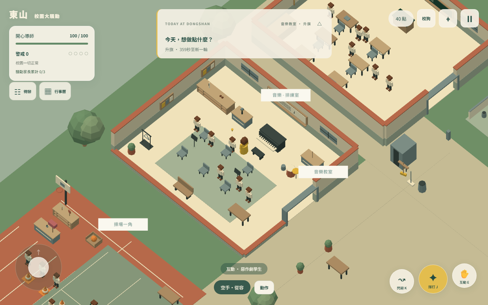
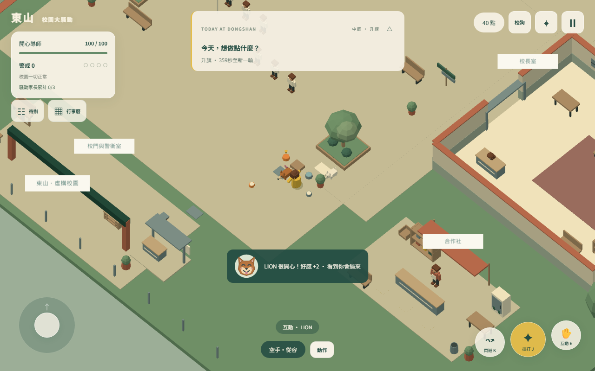
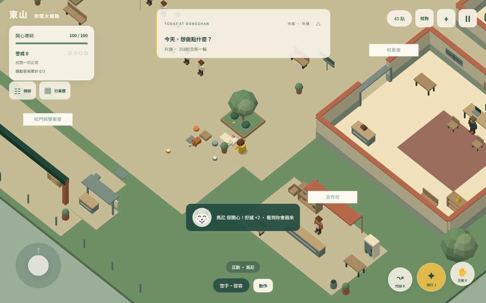
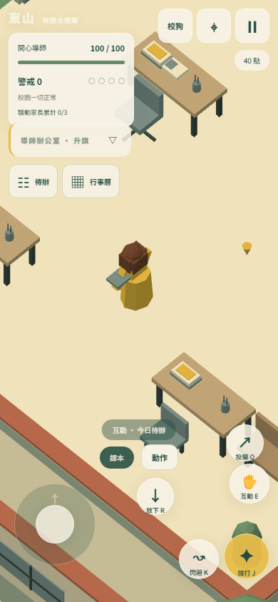
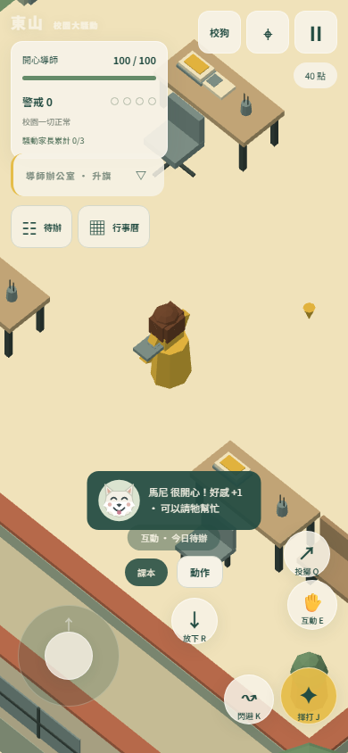
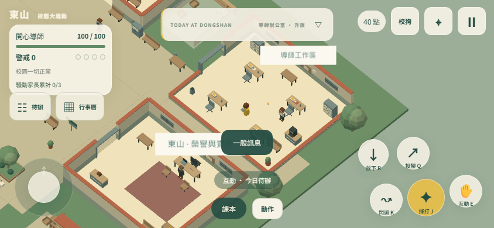
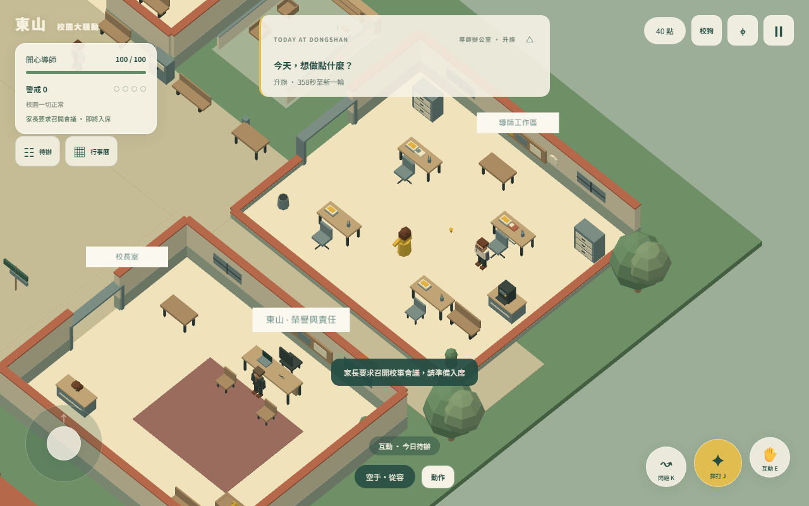
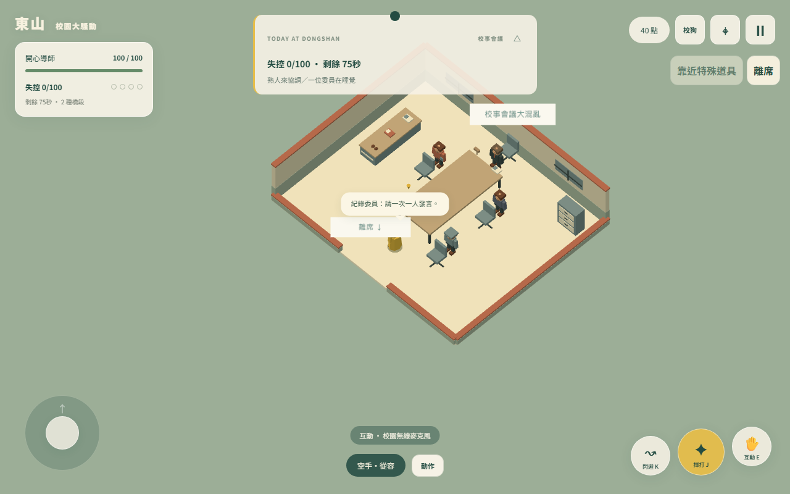

# v1.3.1 會議、狗狗笑臉與場景介面驗收

日期：2026-10-08。整合現有 v1.3 六種校園生活事件及先前會議／校狗／理化老師修改，保留所有既有工作目錄變更。本次已重新產出 dist；推送 main 後由 GitHub Actions 執行測試、建置及 Pages 部署。

## 玩家操作

- 因騷動實際到校的家長累計達三位後，每次成功 J／揮打（徒手、持物、空揮）有 50% 機率開會；HUD 顯示累計、就緒與冷卻。雙人家長計兩位，中性陀螺事件家長不計；同時在場名額仍為三位。
- 抽中先提示約 1.2 秒，再入席；不必先倒地。同次揮打只抽一次，攻擊冷卻、隱藏、待入席與會議中不重抽。散場冷卻 60 個可操作校園秒、重新累計；舊家長離校騰出名額，生活事件預約角色維持原事件流程。
- 校狗實際增加好感時顯示該狗笑臉與實際增加值，約三秒共同淡出。桌面 52px、手機 48px。好感已滿或收益冷卻不顯示笑臉，普通訊息會清除原頭像。
- 持物時右下顯示「放下 R」，手機直接點擊使用既有放下／交付邏輯，保留原物件 ID；空手時隱藏。
- 一般黑板 8→5.6、音樂白板 6→4.2；一般講桌移到正前方中央，粉筆擦與講臺後藏身點同步更新。音樂兩張海報改到左牆並調整朝向、尺寸，與窗戶／白板／器材架無交疊。
- 提示收合符號改為 ▽／△、12px，保持置中。手機收合標題以 span 的 display:none 隱藏，不再使用 font-size:0。

## 驗證結果

| 驗證 | 結果與證據 |
|---|---|
| 全套 Node 測試 | **112 通過、0 失敗**；[完整紀錄](artifacts/meeting-ui-all-tests.log)。含原有全人類狀態受擊、兩狗不受擊、生活事件、場景路徑、物品身份及存檔回歸。 |
| 新會議抽選 | 成功與失敗抽選、徒手／持物、名額限制、中性角色排除、僅成功揮打抽一次、正體力入席、60 秒冷卻、舊 300 秒存檔遷移、離校騰出名額。固定 seed 10,000 次抽選的命中率落在 48%–52%。 |
| 實際瀏覽器操作 | Chromium 141、WebGL／SwiftShader，真實 E 摸摸兩狗、J 開會、點擊放下；[驗收資料](artifacts/meeting-ui-browser-qa.json)、[可重跑腳本](scripts/meeting-ui-qa.ts)。開發入口設定起點、家長與固定種子，用實際操作驗證，不宣稱自然遊玩隨機等待時間。 |
| 手機介面 | 390×844 直式與 844×390 橫式；直式放下按鈕与其他四個圓按鈕矩形不重疊；頭像 48px、99→100 僅顯示 +1、100 時無頭像；收合標題 span 隱藏，符號 12px。此為瀏覽器視窗驗收，非實體手機效能測量。 |
| 正式成品 | TypeScript、Vite build、Pages artifact 檢查通過；六種生活事件、六項狗任務入口、移動、J、新 HUD 與手機提示正常，無頁面錯誤／404，正式版無開發 API。[資料](artifacts/meeting-ui-production-qa.json)、[腳本](scripts/meeting-ui-production-qa.ts)。 |

## 實際遊戲畫面

### 教室佈置

### 兩隻狗的笑臉

### 手機放下與笑臉

### 正體力進入會議

