# 校園改版實際遊戲截圖

以下均由真正遊戲取得，保留HUD；使用開發API準備拍攝位置，沒有以生成圖取代實作。

## 一般教室

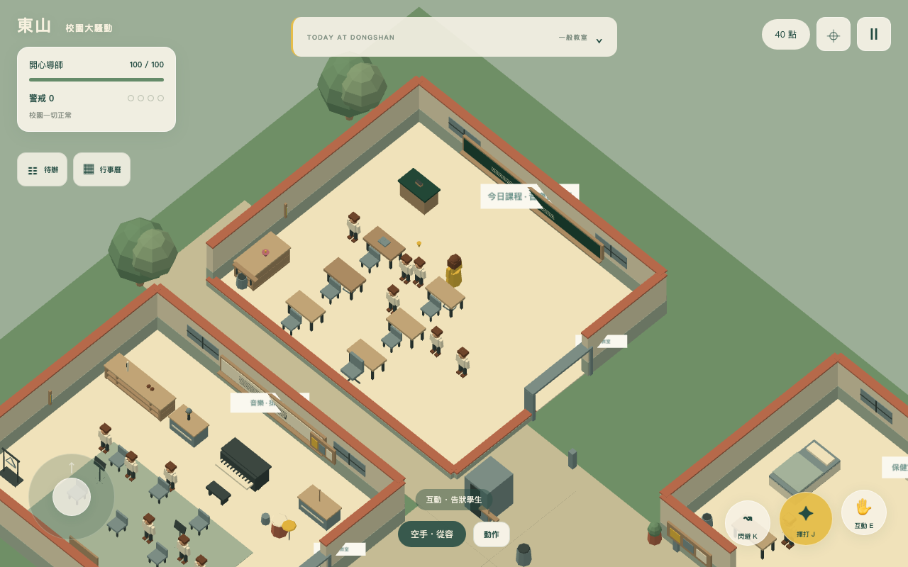

## 音樂教室

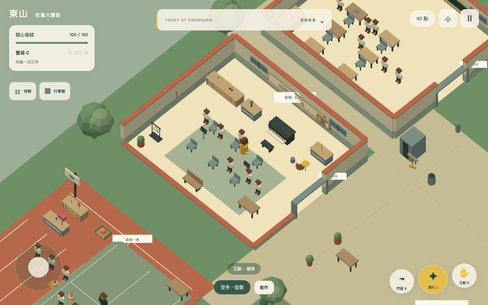

## 導師辦公室

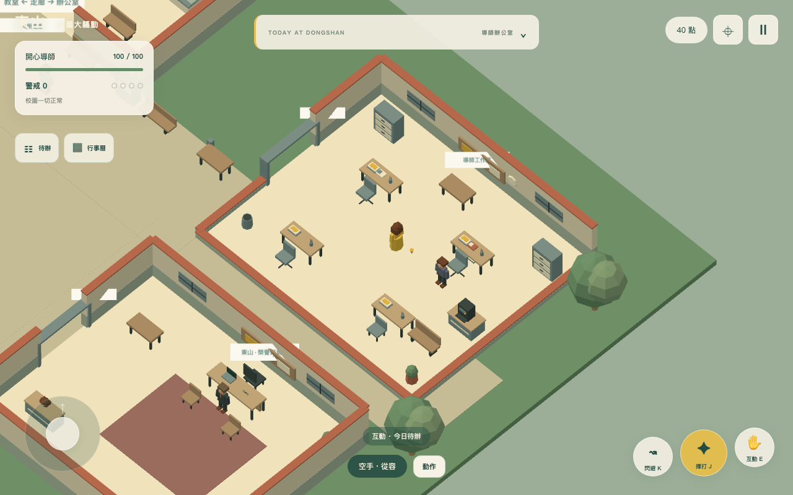

## 校長室

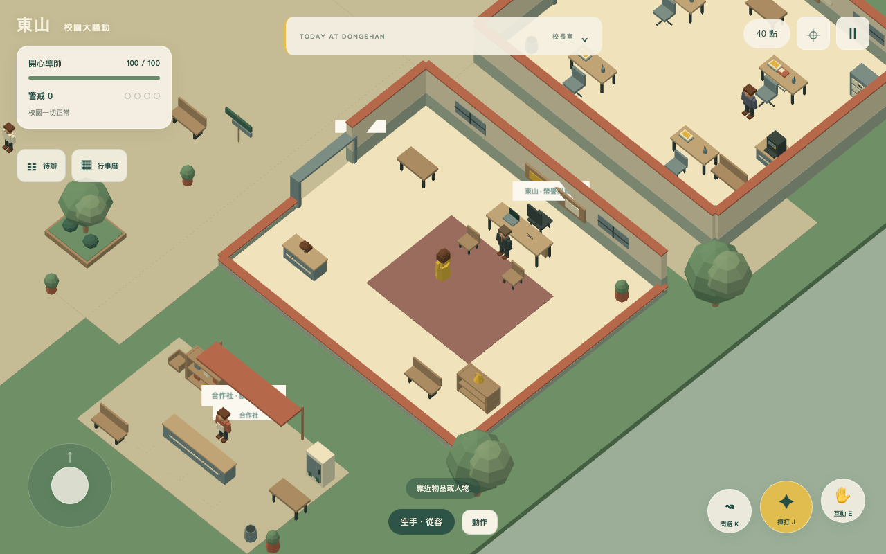

## 共用走廊

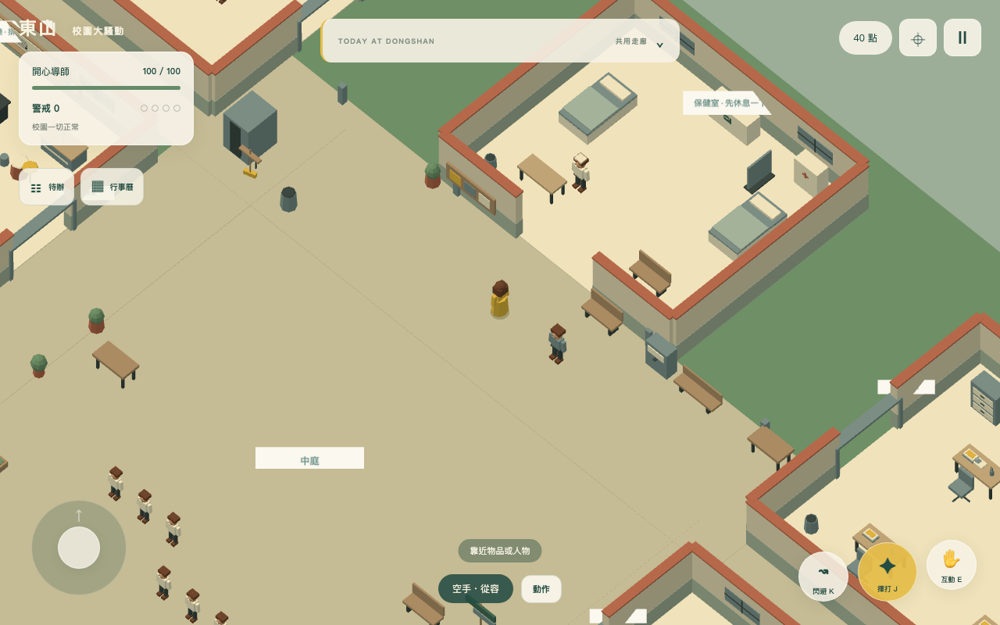

## 中庭

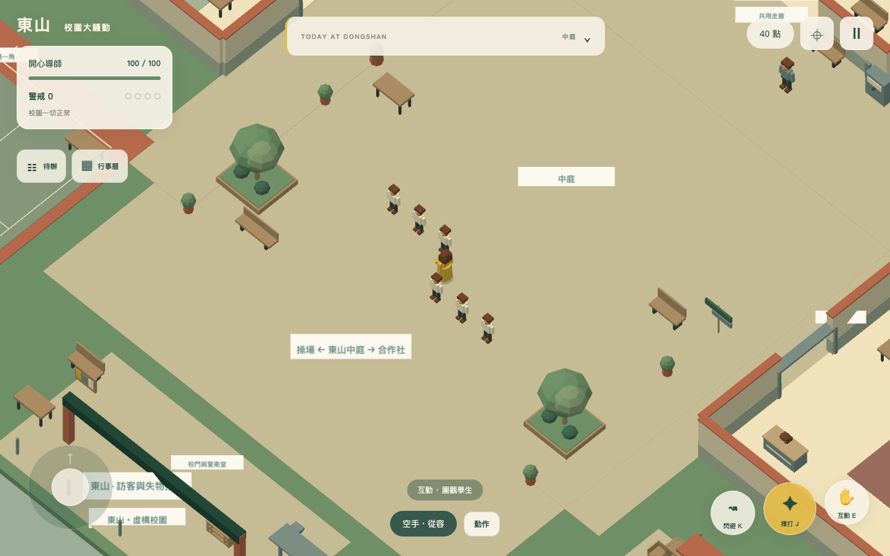

## 操場一角

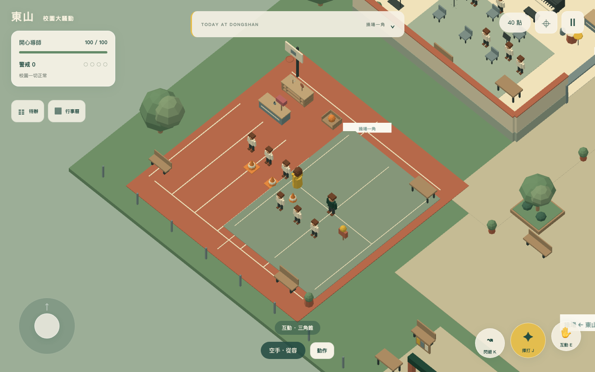

## 校門與警衛室

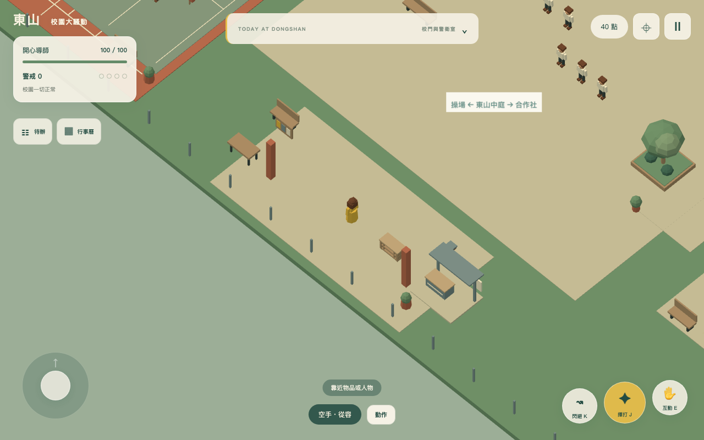

## 合作社

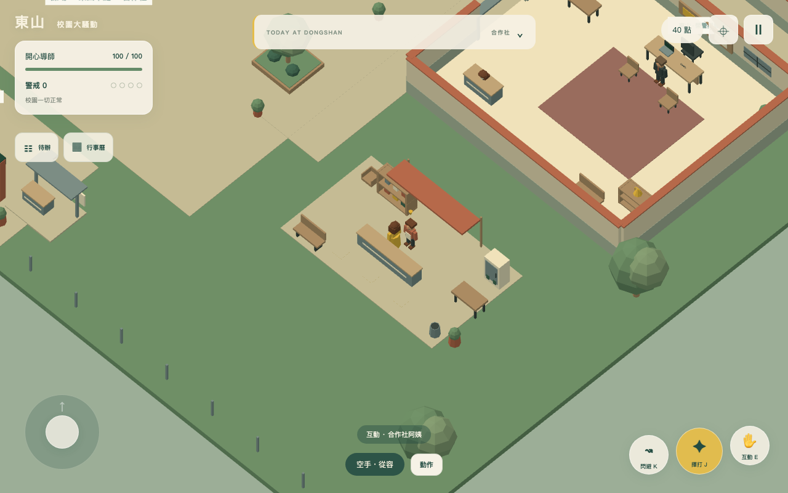

## 保健室

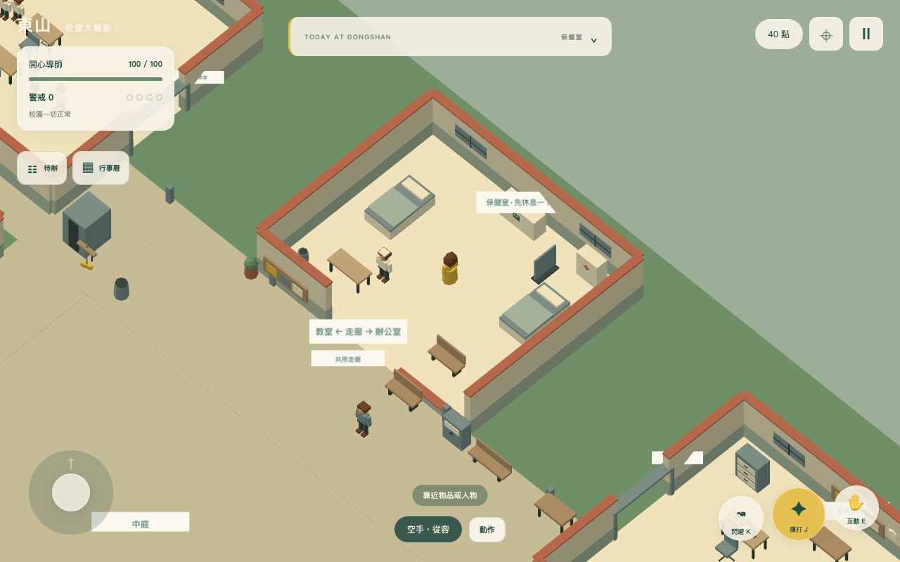

## 親師日

## 校慶

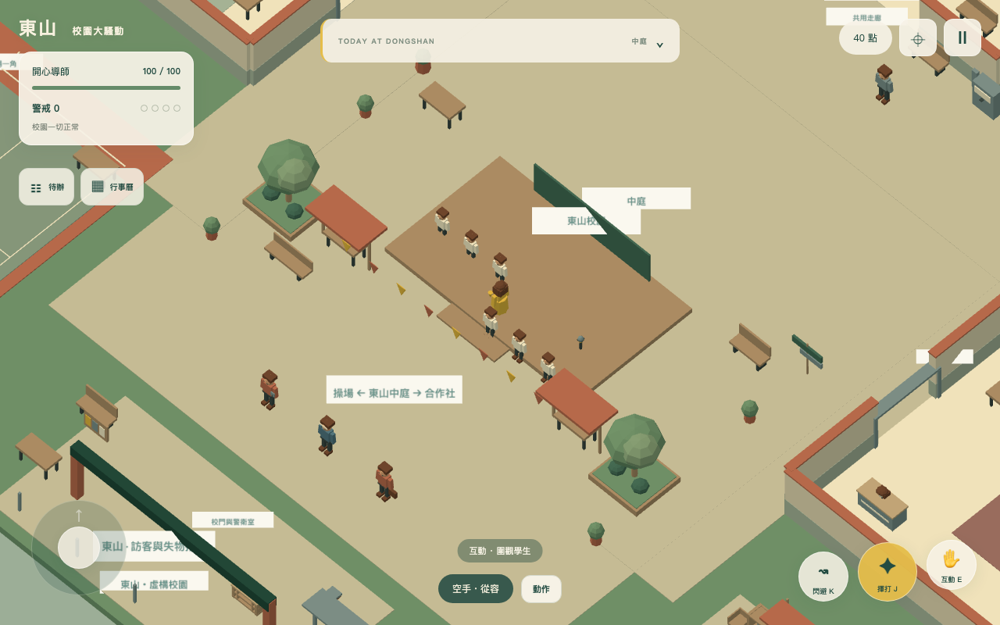

## 合唱團比賽

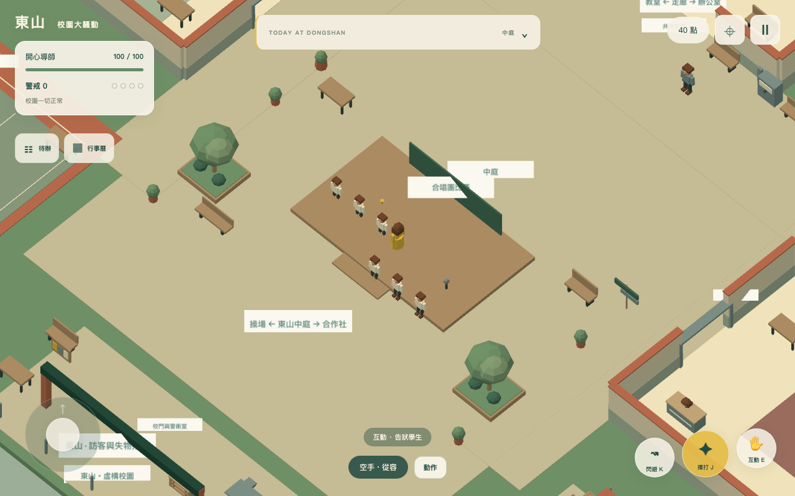

## 期末考

