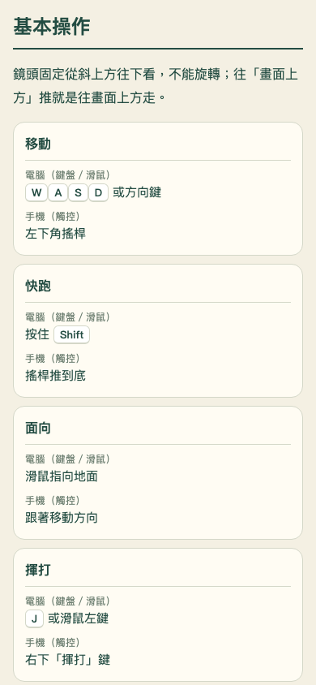

# 新手說明書往返驗收（2026-10-09）

首頁「新手說明書」改成同一分頁前往 tutorial.html，教學頁「開始遊戲」回到同分頁 index.html。修正「所有聲音都是合成」及「電腦版沒有搖桿／操作按鈕」的過時文字。

實測另發現離頁時 pagehide 已釋放存檔寫入權，但緊接的 visibilitychange 會再存檔並重新占用；因此離頁後的背景事件不再儲存。快取恢復時重新啟動存檔寫入權續約，保留原有多分頁保護，不強制接管其他遊戲分頁。

本地正式成品以實際 Chromium 在1280×900、844×390、390×844、320×700測試：鍵盤／觸控進入說明書、只保留一個分頁、離頁寫入權釋放、上一頁返回並再次進入、目錄定位、三張圖片解碼、頁面不橫向溢出、回到遊戲立即存檔成功。已有點數、教學完成、任務、外觀、設定及獎勵紀錄保留；遊戲內操作說明仍可開啟，無頁面例外或資源404。結果記錄是否實際使用快取返回，不將一般歷史返回宣稱為快取命中。

114項遊戲規則測試、TypeScript檢查及Pages成品檢查通過。記錄：artifacts/tutorial-navigation-qa.json、artifacts/tutorial-navigation-core-tests.tap；重現程式：scripts/tutorial-navigation-qa.ts（QA_URL可指定公開站）。

本輪上一頁返回均重新載入，即使開啟快取仍未命中BFcache；快取恢復分支尚未實際執行。實體手機及Safari未驗證。
