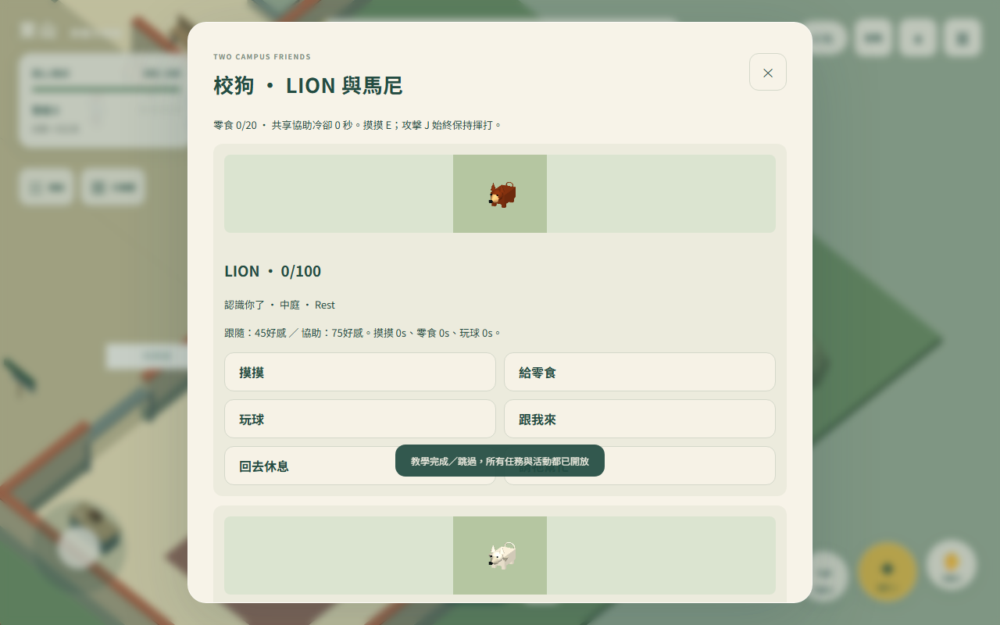

# 說明書截圖更新（2026-10-09）

重新擷取三張目前遊戲畫面，沿用說明書既有主題與尺寸：hud-mobile.png為390×844手機手持課本畫面；meeting.png為1280×800四人校事會議；dog-card.png為1280×800校狗卡片。圖片直接來自目前遊戲渲染，沒有拼接、重繪或改動截圖中的介面；校狗卡片不再被跳過教學訊息蓋住。會議「特殊互動／離席」原有6px間距同步修正為12px。

重拍以既有開發場景入口準備人物位置、拿課本及進入會議，校狗卡片透過實際按鈕開啟。這是實際遊戲畫面，但不宣稱從出生點手動完成會議觸發。三張画面均檢查可見按鈕間距：手機最小8px，校狗與會議12px；手機提示卡和待辦均距上方區塊10px，面板無橫向溢出，無頁面例外。見scripts/tutorial-screenshots.ts及artifacts/tutorial-screenshots-qa.json；來源以1aaa8bc加上本次會議間距修正為準。

建置自動替換教學頁的圖片指紋檔名，讓舊快取不會沿用舊截圖。scripts/tutorial-images-qa.ts驗證三種尺寸、共9次圖片載入，解碼、原始尺寸、內容SHA-256與頁面寬度；詳細結果見artifacts/tutorial-images-qa.json。實體手機與Safari未驗證。

